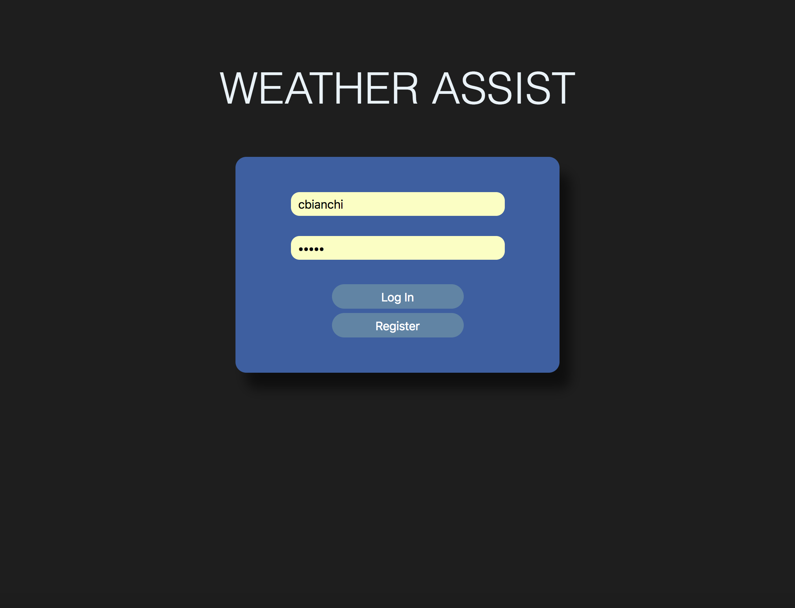
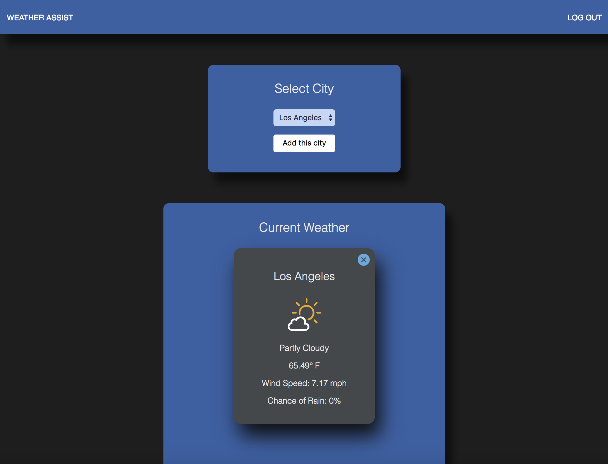
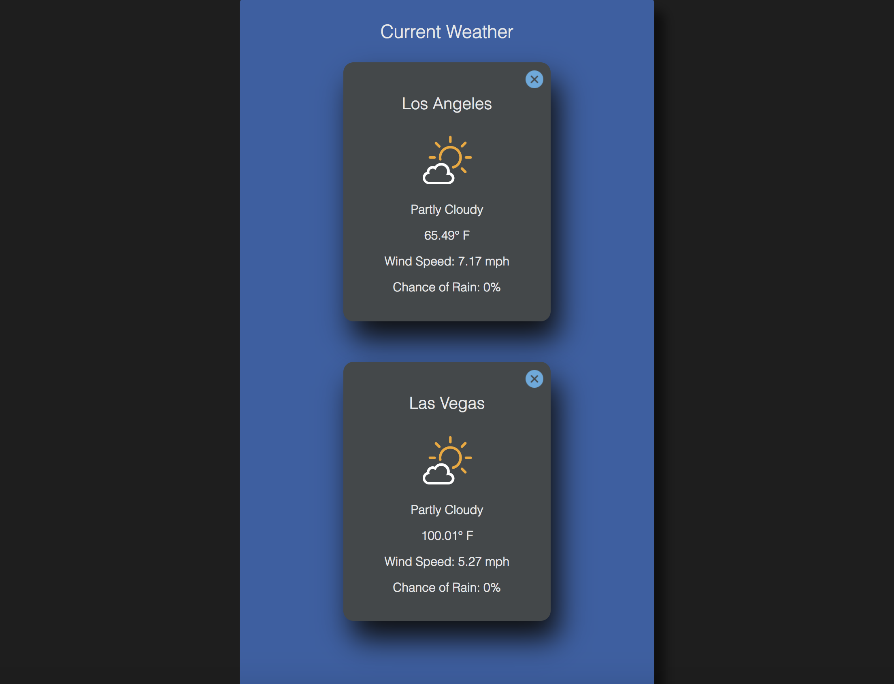

# Weather Assist

## Overview
Weather Assist is a personalized online hub designed to allow users to view the weather of desired cities around the world. This is a front-end application which utilizes React, Redux, and more, to access the Dark Sky Weather API to load the current weather of a location based on latitude and longitude. The Weather Assist app provides the user with full CRUD functionality over all weather objects, while utilizing multiple React component types (redux connect, pure, class, HOCs and more). Application testing includes unit, integration and snapshot testing and is implemented using Jest, and Enzyme

## Core Functionality
1. Users are able to LogIn and register to their personalized account where weather preferences have been saved.
2. Users are able to choose their city of choice via a preloaded dropdown menu. Once selected, a customized weather card of the current summary, temperature, chance of rain, and wind speed, is rendered for the selected city.
3. Each rendered weather card features an svg weather icon which is dynamically rendered based upon the current summary of the location. Types of summaries include: clear, partly cloudy, mostly cloudy, drizzle, rain, and more.
4. Cities are fetched via a customized request to the Dark Sky API, by taking the city's unique longitude and latitude, and placing them within the request url.
5. Users are able to make changes to their list of monitored cities. Such as updating their list, and deleting cards they're no longer interested in.

## Technologies Used
* JavaScript
* React
* Redux
* React Router
* Webpack
* Babel
* ESLint
* Jest
* Enzyme
* NPM

## Deployed To
https://cbianchi-weather-assist.herokuapp.com/
View in the Chrome browser.

## Log In and Registration
1. To login with preexisting account information use username: cbianchi, and for password: pass1
2. To register, type a valid username and password into the initial login form, and then click the register button to be added as a user with said info.

## Wire Frame

## Installation
1. Clone down the repository
2. From the cloned directory run `npm install`
3. Run the app on localhost:3000 by default, `npm start`
4. For testing run `npm test` from the same directory
